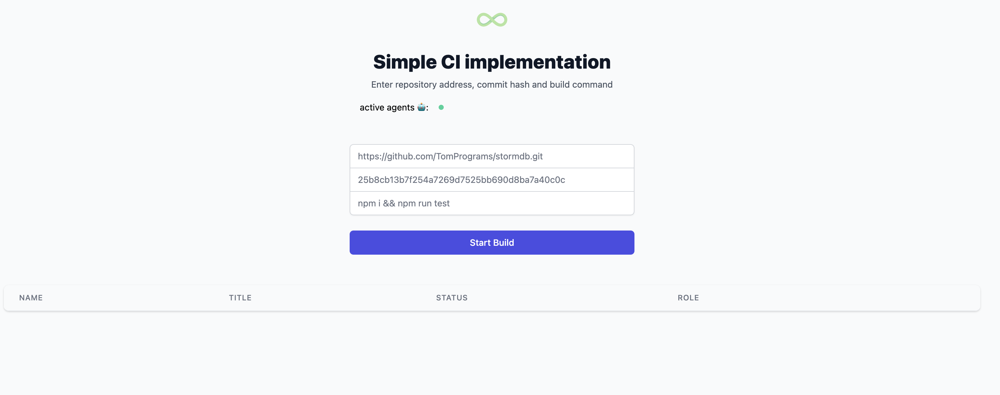

# Simple CI implementation


## Requirements
- node.js -v 14.17.0 
- npm -v 6.14.3

### Run project
```
npm i
npm start:server
npm start:agent

// For manually agents start
ts-node --project ./tsconfig.json ./agent/index.ts --port="<port number>"
```

### Essentials


1. Agents connected to server via web sockets
2. Server attached agents to rooms active or busy 
   (views connected to view room)
3. User submits the form (screenshot above)
4. Agent handle the build and emits events
5. Server save build data in stormDB


