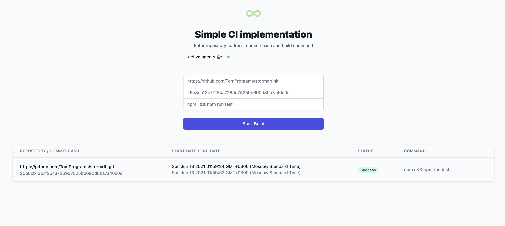
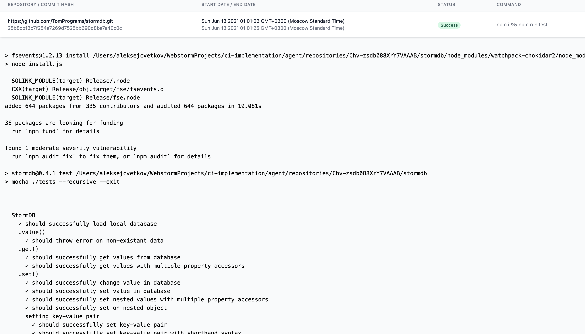

# Simple CI implementation


## Requirements
- node.js -v 14.17.0 
- npm -v 6.14.3

### Run project
```
npm i
npm start:server
npm start:agent

// For manually agents start
ts-node --project ./tsconfig.json ./agent/index.ts --port="<port number>"
```

### Essentials


1. Agents attach and detach to server via web sockets automatically
2. Server attached agents to rooms active or busy 
   (views connected to view room)
3. User submits the form (screenshot above)
4. Agent handle the build and emits events
5. Server generates a unique build id and save build data in stormDB

__Details__


1. On the detail page we will see stdout for specific build
2. Status - success, failure or progress
3. Executed command
4. Start and finish of the build

### Project structure

```
.env - environmental variable PORT for server.

./agent
├── config
├── index.ts
├── loaders
├── repositories - create and clear automatically 
└── services - there is a build process and connect to socket logic

./server
├── api - routes /, POST /build, GET /build/:buildId"
├── config
├── db - stormDB, cleared after restart server
├── index.ts
├── loaders - initializers logger, db and socket.io
├── public
├── services - socket.io and http services
└── views - main page view and build detail view
```


